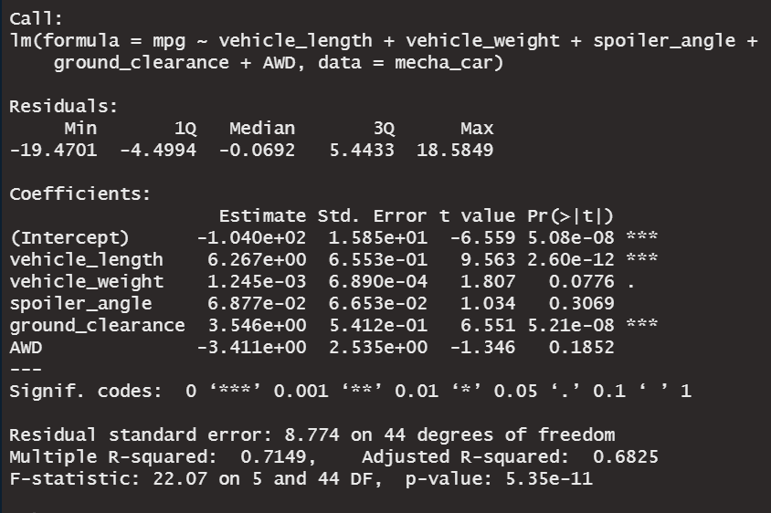

# MechaCar_Statistical_Analysis

## Linear Regression to Predict MPG

According to the summary output of the multiple linear regression model, vehicle length and ground clearance (and intercept) are statistically unlikely to provide random amounts of variance. They have a significant impact on the miles per gallon (mpg) values in the dataset.

The slope of the linear model is not considered to be zero because there is a significant linear relationship. Additionally, the p-value of our linear regression analysis is smaller than the assumed significance level of 0.05%. This indicates that there is sufficient evidence to reject the null hypothesis and confirm that the slope is not zero.

The linear model predicts mpg of MechaCar prototypes effectively as evidenced by a r-squared value of 0.71, indicating a strong correlation of the dataset.

## Summary Statistics on Suspension Coils

Summary statistics were generated in order to compare any suspension coil production differences between each of the manufacturing plants at MechaCar. Design specifications dictate that the variance of the suspension coils must not exceed 100 pounds per square inch.

Based on the current pounds per square inch (PSI) data for all three manufacturing lots, the total variance is acceptable at 62.29 PSI. 

Lot1 and Lot2 both have acceptable variance of 0.98 PSI and 7.47 PSI, respectfully. However, when analyzng each manufacturing lot individually the data shows that the variance for Lot3 is unacceptable as evidenced by a variance of 170.29 PSI.

## T-Tests on Suspension Coils

A T-Test was performed on suspension coil data in order to determine if the PSI across all manufacturing lots is statistically different from the population mean of 1,500 pounds per square inch. Assuming the significance level was the common 0.05 percent, our p-value of 0.06 is above our significance level. Therefore, there is not sufficient evidence to reject the null hyposthesis and it acceptable to determine that the two means of the population and sample data are statistically similar.

A T-Test performed on Lot 1 returned a p-value of 1, indicating that there is not sufficient evidence to reject the null hypothesis and it is acceptable to determine that the PSI for this lot is statistically similar to the polulation mean of 1,500 PSI.

A T-Test performed on Lot 2 returned a p-value of 0.61, indicating that there is not sufficient evidence to reject the null hypothesis and it is acceptable to determine that the PSI for this lot is statistically similar to the polulation mean of 1,500 PSI.

Lastly, a T-Test performed on Lot 3 returned a p-value of 0.42, indicating that there is sufficient evidence to reject the null hypothesis and it is acceptable to determine that the PSI for this lot is statistically different to the polulation mean of 1,500 PSI. It is recommended that this manufacturing lot be evaluated further to find the issue causing the difference in suspension coil production.

